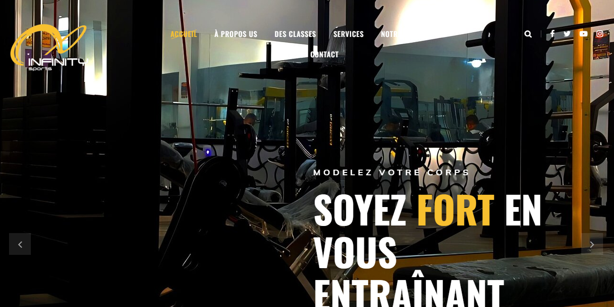

# InfinitySports Gym Website

The InfinitySports Gym website is your one-stop destination for all things related to our fitness center. This website, built using only HTML and CSS, provides information about our gym, its services, class schedules, and more.

## Features

- **Homepage**: A welcoming homepage with an overview of our gym's offerings and a featured class of the month.
- **About Us**: Learn about our gym's history, mission, and values.
- **Services**: Explore the range of services we offer, including fitness classes, personal training, and more.
- **Class Schedule**: View the weekly class schedule to plan your workouts.
- **Contact**: Find contact information to get in touch with our team for inquiries or bookings.
- **Responsive Design**: The website is designed to be responsive, ensuring it looks great on various devices.

## How to Access

You can access the InfinitySports Gym website by following these steps:

1. Clone the repository:
   >git clone this repo
   >cd infinitysports-website

2. Open the `index.html` file in your web browser to explore the website.

## Contributing

Contributions to improve or enhance the InfinitySports Gym website are welcome! If you'd like to contribute, please follow these steps:

1. Fork the repository.
2. Create a new branch for your feature or improvement.
3. Make your changes, ensuring they follow best practices and maintain the website's style.
4. Submit a pull request, describing the changes and their significance.

## License

This project is licensed under the [MIT License](LICENSE).

## Contact

If you have any questions or need assistance regarding the InfinitySports Gym website, please feel free to contact us at mohamedaminefki0002@gmail.com.

## Acknowledgments

- Special thanks to our gym members and the InfinitySports team for their support.
- Inspiration for the website design and content comes from our commitment to promoting a healthy lifestyle.

